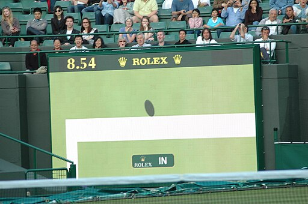
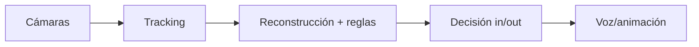
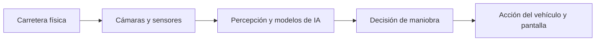

# PEC3: Visionando el futuro con las gafas de Manovich

### Ensayo sobre la hibridación en los casos del Hawk-Eye en el tenis y el FSD Tesla
Autor: José David Montilla Merino

Fecha: Diciembre 2025

# Hawk-Eye en el tenis: cuando la línea se convierte en software

*[Mvkulkarni23](https://commons.wikimedia.org/wiki/File:The_decision_of_In_or_Out_with_the_help_of_Technology_at_Wimbledon.jpg), [CC BY-SA 3.0](https://creativecommons.org/licenses/by-sa/3.0), via Wikimedia Commons

## · Qué es

En tenis, una bola que cae rozando la línea puede decidir un set, un partido o una carrera. Históricamente, ese instante se resolvía con un pacto humano: jueces de línea observan, cantan “out” (o mantienen silencio *si la bola ha botado dentro*), y el árbitro de silla gestiona la tensión. **Hawk-Eye** (y su despliegue como **Electronic Line Calling**, ELC) desplaza ese pacto hacia un sistema técnico: cámaras alrededor de la pista, procesamiento que reconstruye el bote y una salida inmediata (voz, marcador o animación) que dicta el veredicto.

La modalidad **Live ELC** lo deja especialmente claro: el reglamento ATP establece que _no hay jueces de línea_ y que _todas las líneas_ se cantan con el sistema Live ELC aprobado. ([ATP Tour](https://www.atptour.com/-/media/files/rulebook/2025/2025-rulebook_20may.pdf?utm_source=chatgpt.com "The 2025 ATP® Official Rulebook"))  

## · Por qué es un caso de hibridación

Desde el punto de vista de Manovich, **Hawk-Eye** no es solo un añadido visual (multimedia) ni una simple repetición televisiva (remediación). Es hibridación porque fusiona lenguajes y técnicas que antes operaban por separado —captura audiovisual, geometría, cálculo, normativa y visualización— hasta formar un único medio operativo: un *arbitraje-software*.

Manovich lo resume con la idea de:

> “El resultado de la hibridación no es tan solo la suma mecánica de las partes existentes previamente, sino una nueva «especie»”. (Manovich, 2013, p. 288)

Aquí lo remezclado no es el partido como espectáculo, sino el método de decidir. La pelota física se traduce a datos; los datos se vuelven trayectoria y punto de bote; y ese resultado vuelve al partido como veredicto. Por eso la animación del “Official Review” no funciona como adorno: es la interfaz final de un cálculo diseñado para cerrar la duda. Además, el sistema introduce una estética de “prueba”: una visualización limpia, casi forense, que busca convencer y clausurar el debate en segundos.

Esta fusión crea un lenguaje nuevo. La línea deja de ser solo pintura blanca; pasa a ser una frontera computable. El visualizar deja de ser percepción y se convierte en medida. Y también cambia la interacción: antes la controversia era interpersonal, entre los jugadores y el juez; con este sistema, el conflicto se desplaza a la infraestructura, es el sistema informático el que determinará donde ha botado la bola. Incluso la autoridad se redistribuye: del juez y su criterio situacional a un protocolo técnico, validado y aceptado por la competición. La hibridación, por tanto, no solo afecta a la imagen: reordena roles, tiempos y autoridad dentro del juego.

*Figura 1. YouTube Shorts: ejemplo visual de Hawk-Eye (consultado en diciembre de 2025).*
		  

## · Conclusión

**Hawk-Eye** es, bajo mi punto de vista,  un caso sólido de hibridación porque transforma una práctica profundamente humana —mirar, interpretar y decidir— en una cadena integrada de **captura, datos, cálculo e interfaz**, respaldada por reglamentos y estándares. En ese proceso, el tenis no cambia de esencia (sigue habiendo talento, estrategia, presión y error), pero sí cambia el lugar donde se cierra la duda. *El punto exacto del bote*, que antes dependía de una percepción situada y discutible, pasa a resolverse mediante una representación computacional presentada como prueba.

Lo más interesante es que la tecnología no elimina el conflicto: lo desplaza. Donde antes se discutía la visión o la imparcialidad, ahora se discuten la fiabilidad del sistema, sus protocolos y sus excepciones. Aun así, su impacto es innegable: reordena tiempos, roles y autoridad, y altera el relato emocional del partido. Mirado con Manovich, Hawk-Eye no es un complemento; es una nueva “especie” de arbitraje, un medio híbrido en el que **lo real se convierte en dato y el dato vuelve al juego como veredicto**.

# Tesla FSD: cuando la carretera se convierte en software

[Vista urbana desde el interior de Tesla](images/interior-Tesla.png)

*Figura 2. Interior de Tesla con nube de fórmulas (imagen generada, diciembre de 2025).*

## · Qué es

En Tesla, lo de **Full Self-Driving (FSD)** suena a *el coche conduce solo*, pero en la práctica es más realista pensarlo como un copiloto muy avanzado. Hace muchas cosas por ti: puede seguir una ruta, mantenerse en su carril, gestionar incorporaciones, moverse en rotondas, adelantar y hasta aparcar con bastante autonomía. Ahora bien, no es un sustituto del conductor. Tú sigues ahí, vigilando, con la obligación de intervenir si algo no va como debería.

Lo que lo diferencia de otras ayudas más clásicas no es solo la lista de funciones, sino la forma en que decide. No funciona como un sistema de reglas rígidas de *si ocurre esto, entonces haz lo otro*. Se parece más a alguien que ha practicado muchísimo: usa modelos de inteligencia artificial entrenados con enormes cantidades de conducción real. Cada Tesla que circula con FSD va generando información sobre cómo se mueve el tráfico, qué hacen los demás, cómo cambia la carretera o qué pasa cuando llueve, hay obras o la señalización es confusa. Esa experiencia se acumula, se procesa, y el sistema se va afinando con el tiempo.

*Figura 1. YouTube: ejemplo visual de Tesla FSD (consultado en diciembre de 2025).*

Y aquí viene el cambio de mentalidad: el coche ya no es un producto acabado el día que lo compras. Es más parecido a un dispositivo digital. Con actualizaciones remotas, Tesla puede ajustar comportamientos, mejorar detecciones o cambiar cómo reacciona en ciertas situaciones sin tocar el hardware. Por eso la sensación es que el coche *evoluciona*: no solo depende de su mecánica, sino de la versión del software que lleve instalada y de todo lo que ese software ha ido aprendiendo a partir de millones de kilómetros de la flota.

## · Por qué es un caso de hibridación

Si aplicamos el marco de la hibridación de Manovich, Tesla FSD no es solo un coche moderno con pantalla grande ni un GPS más sofisticado. Lo interesante es que mezcla varias lógicas que antes estaban separadas —mapa digital, cuadro de instrumentos, simulación y control del vehículo— y las convierte en un único medio operativo. No es solo equipamiento añadido: **es una nueva manera de conducir mediada por código.**

Lo primero que se aprecia es que el sistema mira el mundo de otra manera. Donde nosotros percibimos la carretera como un todo (asfalto, coches, señales), FSD trabaja con piezas: carriles, vehículos, peatones, bordillos, semáforos… Todo se etiqueta, se mide y se convierte en datos. Aquí podríamos encajar la idea de transcodificación de Manovich: el entorno físico se traduce a un lenguaje computable (vectores, probabilidades, trayectorias) y, desde ese lenguaje, el coche decide cómo actuar. En ese paso, la carretera deja de ser solo espacio de circulación y se convierte también en una **base de datos viva**.

La pantalla central es la parte visible de esa traducción. No estamos viendo *la realidad*, sino una **versión sintetizada de la realidad** según la interpreta la máquina: líneas que dibujan carriles, iconos para otros coches, figuras para peatones o ciclistas. Es una representación que recuerda a un videojuego minimalista, pero con una diferencia clave: aquí la visualización no es decorativa. Es la interfaz final de un cálculo que termina en acciones reales: frenar, acelerar, girar o mantener la trayectoria. Igual que en Hawk-Eye la animación no es un adorno sino la forma de cerrar una decisión, en FSD la imagen en pantalla es la cara visible de un sistema que está conduciendo parcialmente.

La hibridación también se nota en la interacción. Con Tesla FSD, conducir ya no es solo nuestras acciones típicas de conducción ( frenar, acelerar, girar,...) Es activar un modo, aceptar o interrumpir maniobras, responder a avisos de atención, vigilar el comportamiento del sistema y decidir cuándo intervenir. La agencia queda repartida: ni conducción manual pura ni autonomía total, sino una especie de conducción compartida donde el conductor negocia continuamente con el algoritmo. En términos de **interfaz cultural**, el coche se convierte en un espacio donde cambian hábitos y expectativas: qué significa controlar, en qué confiamos, cuándo dudamos y cómo interpretamos lo que hace la máquina.

Y al final podemos encontrar una idea muy de Manovich: la **variabilidad**. Un Tesla con FSD no es un coche que compras y se queda igual para siempre. Puede comportarse distinto de un mes a otro simplemente porque recibe una actualización: de repente detecta mejor ciertos objetos, ejecuta una maniobra con más suavidad o reacciona de otra forma ante una situación concreta.

Por eso la *personalidad* al volante ya no depende solo de quien conduce. También depende de la versión del sistema que llevas instalada y de cómo se ha ido afinando el modelo con datos de la flota. En el fondo, esa posibilidad de reescribirse convierte al coche en algo más parecido a una plataforma digital que a un vehículo tradicional.

> “En FSD, la conducción es una coreografía híbrida: vigilancia humana arriba, cálculo algorítmico abajo, y el coche como puente que lo convierte en movimiento.”

## · Conclusión

Desde mi punto de vista, Tesla FSD es un caso sólido de hibridación porque convierte la conducción en una práctica compartida entre humano y software. Lo que antes se resolvía únicamente con percepción y reflejos ahora pasa por una cadena integrada de captura de datos, interpretación algorítmica y visualización en pantalla. La carretera se convierte en información, y esa información vuelve al mundo físico en forma de giros, frenadas y aceleraciones.

Al igual que Hawk-Eye trasladaba la decisión de *dentro o fuera* a un sistema técnico, FSD desplaza parte del control del volante a un conjunto de modelos y protocolos que no vemos, pero en los que debemos confiar para usar el sistema. La hibridación no solo afecta a la imagen que vemos en la pantalla, sino a cómo entendemos hoy la responsabilidad, la autonomía y la propia experiencia de *ir conduciendo* en la cultura digital.

## · Bibliografía / Webgrafía
   
- Association of Tennis Professionals. (2025). *2025 ATP® Official Rulebook* (Exhibit T.2: Live Electronic Line Calling). https://www.atptour.com/-/media/files/rulebook/2025/2025-rulebook_20may.pdf  
- Chute Dkv. (s. f.). *Sistema Hawk Eye #hawkeye #tenis #deporte #datoscuriosos #shorts #ChuteDkv* [Video]. YouTube. Recuperado el 16 de diciembre de 2025, de https://youtube.com/shorts/Xnk2gWWY0dY  
- International Tennis Federation. (2025). *Electronic Line-Calling Systems: Evaluation Procedures* (v28, June 2025). https://www.itftennis.com/media/14686/elc-evaluation-procedures-v28-june-2025.pdf  
- International Tennis Federation. (2025, July 23). *New classification tiers for electronic line calling systems*. https://www.itftennis.com/en/news-and-media/articles/new-classification-tiers-for-electronic-line-calling-systems/  
- Manovich, Lev. _El software toma el mando_, Editorial UOC, 2013. _ProQuest Ebook Central_, https://ebookcentral.proquest.com/lib/bibliouocsp-ebooks/detail.action?docID=4735140. 
- Mvkulkarni23. (s. f.). *The decision of In or Out with the help of Technology at Wimbledon* [Photograph]. Wikimedia Commons. https://commons.wikimedia.org/wiki/File:The_decision_of_In_or_Out_with_the_help_of_Technology_at_Wimbledon.jpg 
- OpenAI. (2025). *Interior de Tesla con nube de fórmulas* [Imagen generada]. ChatGPT. Recuperado en diciembre de 2025.
 
-  Tesla. (2025, Junio). *Tesla Delivers Itself to New Owner* [Video]. YouTube. Recuperado  de https://youtu.be/GU16hXSSGKs

- Tesla. (s. f.). *Autopilot and Full Self-Driving capability*. Tesla. Recuperado en diciembre de 2025, de https://www.tesla.com/support/autopilot  
- Tesla. (s. f.). *Full Self-Driving (Supervised)*. Tesla. Recuperado en diciembre de 2025, de https://www.tesla.com/support/fsd  
- *Tesla Autopilot*. (s. f.). En *Wikipedia*. Recuperado en diciembre de 2025, de https://en.wikipedia.org/wiki/Tesla_Autopilot  

## Nota sobre el uso de inteligencia artificial

Este trabajo ha contado con apoyo puntual de **ChatGPT (OpenAI, 2025)** para tareas de documentación, organización y revisión formal del texto. El análisis, la selección de fuentes y la redacción final son propios.

## Nota sobre el uso de inteligencia artificial

Este trabajo ha contado con apoyo puntual de **ChatGPT (OpenAI, 2025)** para tareas de organización y revisión formal; el análisis y la redacción final son propios.
