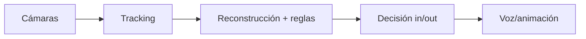

# PEC3: Visionando el futuro con las gafas de Manovich

### Ensayo sobre la hibridación en los casos del Hawk-Eye en el tenis y el FSD Tesla
Autor: José David Montilla Merino

Fecha: Diciembre 2025

# Hawk-Eye en el tenis: cuando la línea se convierte en software

*[Mvkulkarni23](https://commons.wikimedia.org/wiki/File:The_decision_of_In_or_Out_with_the_help_of_Technology_at_Wimbledon.jpg), [CC BY-SA 3.0](https://creativecommons.org/licenses/by-sa/3.0), via Wikimedia Commons

## · Qué es

En tenis, una bola que cae rozando la línea puede decidir un set, un partido o una carrera. Históricamente, ese instante se resolvía con un pacto humano: jueces de línea observan, cantan “out” (o no), y el árbitro de silla gestiona la tensión. **Hawk-Eye** (y su despliegue como **Electronic Line Calling**, ELC) desplaza ese pacto hacia un sistema técnico: cámaras alrededor de la pista, procesamiento que reconstruye el bote y una salida inmediata (voz, marcador o animación) que dicta el veredicto.

La modalidad **Live ELC** lo deja especialmente claro: el reglamento ATP establece que _no hay jueces de línea_ y que _todas las líneas_ se cantan con el sistema Live ELC aprobado. ([ATP Tour](https://www.atptour.com/-/media/files/rulebook/2025/2025-rulebook_20may.pdf?utm_source=chatgpt.com "The 2025 ATP® Official Rulebook"))  

## · Por qué es un caso de hibridación

Desde el punto de vista de Manovich, **Hawk-Eye** no es solo un añadido visual (multimedia) ni una simple repetición televisiva (remediación). Es hibridación porque fusiona lenguajes y técnicas que antes operaban por separado —captura audiovisual, geometría, cálculo, normativa y visualización— hasta formar un único medio operativo: un *arbitraje-software*.

Manovich lo resume con la idea de:

> “El resultado de la hibridación no es tan solo la suma mecánica de las partes existentes previamente, sino una nueva «especie»”. (Manovich, 2013, p. 288)

Aquí lo remezclado no es el partido como espectáculo, sino el método de decidir. La pelota física se traduce a datos; los datos se vuelven trayectoria y punto de bote; y ese resultado vuelve al partido como veredicto. Por eso la animación del “Official Review” no funciona como adorno: es la interfaz final de un cálculo diseñado para cerrar la duda. Además, el sistema introduce una estética de “prueba”: una visualización limpia, casi forense, que busca convencer y clausurar el debate en segundos.

Esta fusión crea un lenguaje nuevo. La línea deja de ser solo pintura blanca; pasa a ser una frontera computable. El visualizar deja de ser percepción y se convierte en medida. Y también cambia la interacción: antes la controversia era interpersonal, entre los jugadores y el juez; con este sistema, el conflicto se desplaza a la infraestructura, es el sistema informático el que determinará donde ha botado la bola. Incluso la autoridad se redistribuye: del juez y su criterio situacional a un protocolo técnico, validado y aceptado por la competición. La hibridación, por tanto, no solo afecta a la imagen: reordena roles, tiempos y autoridad dentro del juego.

*Figura 1. YouTube Shorts: ejemplo visual de Hawk-Eye (consultado en diciembre de 2025).*
		  

## · Conclusión

**Hawk-Eye** es, bajo mi punto de vista,  un caso sólido de hibridación porque transforma una práctica profundamente humana —mirar, interpretar y decidir— en una cadena integrada de **captura, datos, cálculo e interfaz**, respaldada por reglamentos y estándares. En ese proceso, el tenis no cambia de esencia (sigue habiendo talento, estrategia, presión y error), pero sí cambia el lugar donde se cierra la duda. *El punto exacto del bote*, que antes dependía de una percepción situada y discutible, pasa a resolverse mediante una representación computacional presentada como prueba.

Lo más interesante es que la tecnología no elimina el conflicto: lo desplaza. Donde antes se discutía la visión o la imparcialidad, ahora se discuten la fiabilidad del sistema, sus protocolos y sus excepciones. Aun así, su impacto es innegable: reordena tiempos, roles y autoridad, y altera el relato emocional del partido. Mirado con Manovich, Hawk-Eye no es un complemento; es una nueva “especie” de arbitraje, un medio híbrido en el que **lo real se convierte en dato y el dato vuelve al juego como veredicto**.

## · Bibliografía (APA 7)

- Association of Tennis Professionals. (2025). _2025 ATP® Official Rulebook_ (Exhibit T.2: Live Electronic Line Calling). ([ATP Tour](https://www.atptour.com/-/media/files/rulebook/2025/2025-rulebook_20may.pdf?utm_source=chatgpt.com "The 2025 ATP® Official Rulebook"))  
- Chute Dkv. (s. f.). *Sistema Hawk Eye #hawkeye #tenis #deporte #datoscuriosos #shorts #ChuteDkv* [Video]. YouTube. Recuperado el 16 de diciembre de 2025, de https://youtube.com/shorts/Xnk2gWWY0dY
- International Tennis Federation. (2025). _Electronic Line-Calling Systems: Evaluation Procedures_ (v28, June 2025). ([itftennis.com](https://www.itftennis.com/media/14686/elc-evaluation-procedures-v28-june-2025.pdf?utm_source=chatgpt.com "Electronic Line- Calling Systems: Evaluation Procedures"))  
- International Tennis Federation. (2025, July 23). _New classification tiers for electronic line calling systems_. ([itftennis.com](https://www.itftennis.com/en/news-and-media/articles/new-classification-tiers-for-electronic-line-calling-systems/?utm_source=chatgpt.com "New classification tiers for electronic line calling systems"))
- Mvkulkarni23, CC BY-SA 3.0 <https://creativecommons.org/licenses/by-sa/3.0>, via Wikimedia Commons  

## Nota sobre el uso de inteligencia artificial

Este trabajo ha contado con apoyo puntual de **ChatGPT (OpenAI, 2025)** para tareas de organización y revisión formal; el análisis y la redacción final son propios.
